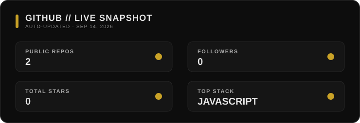

<!-- ═══════════════════════════════════════════════════════════════ -->
<!--                         HERO SECTION                           -->
<!-- ═══════════════════════════════════════════════════════════════ -->

  

    

  

  <h2>Discord Architect · AI Automation Specialist</h2>

  
Building secure, scalable and intelligent systems for modern communities.

  

 

<!-- ═══════════════════════════════════════════════════════════════ -->
<!--                          ABOUT ME                              -->
<!-- ═══════════════════════════════════════════════════════════════ -->

<h3>
  
  
  About Me
</h3>

> **Senior Discord Developer & AI Integration Specialist.**  
> I don't just write code; I architect systems that scale. My focus is on Discord automation, AI-driven bots, and high-security integrations.
>
> معمار سیستم‌های دیسکورد و متخصص هوش مصنوعی. تمرکز من روی طراحی سیستم‌های اتوماسیون مقیاس‌پذیر و امن است. من فقط بات نمی‌سازم؛ زیرساخت‌های هوشمند برای کامیونیتی‌ها مهندسی می‌کنم.

 

<!-- ═══════════════════════════════════════════════════════════════ -->
<!--                       CORE TECH STACK                          -->
<!-- ═══════════════════════════════════════════════════════════════ -->

<h3>
  
  
  Core Tech Stack
</h3>

  
  
  
  

   

  
  
  
  

 

<!-- ═══════════════════════════════════════════════════════════════ -->
<!--                       GITHUB STATISTICS                        -->
<!-- ═══════════════════════════════════════════════════════════════ -->

<h3>
  
  
  GitHub Statistics
</h3>

  

 

<!-- ═══════════════════════════════════════════════════════════════ -->
<!--                           MOONTEAM                             -->
<!-- ═══════════════════════════════════════════════════════════════ -->

<h3>
  
  
  MoonTeam
</h3>

  

    <strong>MoonTeam</strong> is a small, high-focus team dedicated to crafting
    premium Discord infrastructure, intelligent automation, and reliable digital products.
  

  

    <strong>MoonTeam</strong> یک تیم کوچک و دقیق است که بر مهندسی زیرساخت‌های حرفه‌ای
    دیسکورد، اتوماسیون هوشمند و محصولات دیجیتال قابل‌اعتماد تمرکز دارد.
  

   

  

 

<!-- ═══════════════════════════════════════════════════════════════ -->
<!--                        LIVE PRESENCE                           -->
<!-- ═══════════════════════════════════════════════════════════════ -->

<h3>
  
  
  Live Presence
</h3>

  

    A live view of my Discord presence — current status, activity, and active session.
  

  

    نمای زنده‌ای از وضعیت دیسکورد من؛ شامل استاتوس فعلی، اکتیویتی فعال.
  

   

  

 

<!-- ═══════════════════════════════════════════════════════════════ -->
<!--                        COMMAND CENTER                          -->
<!-- ═══════════════════════════════════════════════════════════════ -->

<h3>
  
  
  Command Center
</h3>

  

  

  

  

  

 

  <i>“Code is not just logic; it's an art.”</i>

